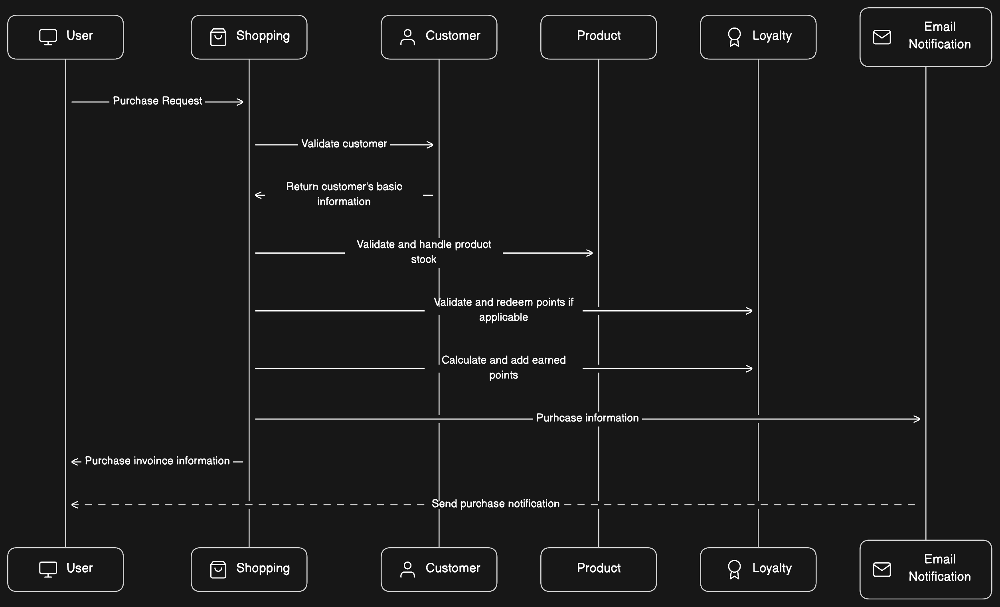

# Purchase Flow

Author: rafavilomar  
Status: `Developing` *[Draft, Developing, In review, Finished]*  
Last updated: 2024-03-18

## Contents

- Objective
- Goals
- No goals
- Overview
- Solution
  - Create Shopping microservice

## Objective

For each purchase is necessary to handle product inventory, loyalty points and email notifications. So, it's necessary 
to use Grpc and Kafka to microservices interactions from a new microservice called Shopping.

## Goals

- Add a new microservice Shopping
- Use grpc and kafka for microservices communication.
- Validate inventory and lot points.
- Send email notification

## No goals

- Add a shopping cart.
- Customize notification email.

## Overview



## Solution

### Create Shopping microservice

### Purchase service

Purchase service needs to call customer, product and points services. And also send the proper email notification to 
customer. This is the first version of this service:

```java
public InvoiceResponse purchase(PurchaseRequest request) {
    String uuid = UUID.randomUUID().toString();
    log.info("================== New purchase {} ==================", uuid);
    log.info("Purchase request for uuid {}: {}", uuid, request);

    CustomerResponse customer = customerServiceBlockingStub.getById(CustomerRequest.newBuilder()
            .setId(request.idCustomer())
            .build());
    PointsResponse redemptionPointsResponse = redeemPoints(request);
    buyProducts(request.products());
    PointsResponse accumulationPointsResponse = accumulatePoints(request);

    log.info("================== Purchase finished {} ==================", uuid);

    InvoiceResponse invoiceResponse = InvoiceResponse.builder()
            .fullname(customer.getFirstName() + " " + customer.getLastName())
            .email(customer.getEmail())
            .products(request.products())
            .pointMovements(getPointsResponse(redemptionPointsResponse, accumulationPointsResponse))
            .subtotal(request.subtotal())
            .total(request.total())
            .tax(request.tax())
            .datetime(request.datetime())
            .build();

    return invoiceResponse;
}
```

